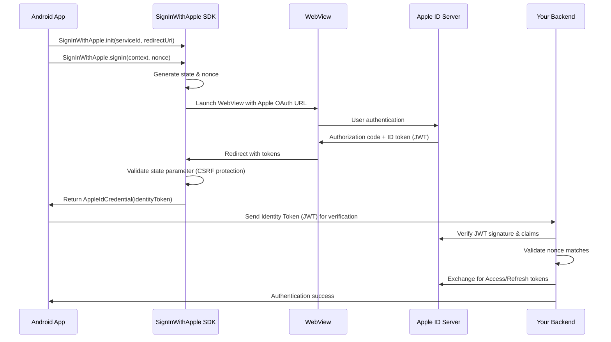

# 🍎 SignInWithApple Android SDK

[](https://jitpack.io/#shinhyo/signin-with-apple)
[](https://android-arsenal.com/api?level=24)
[](https://opensource.org/licenses/MIT)

🤖 **Android library for Apple Sign-In integration.** Since Apple doesn't provide an official Android SDK, this library fills that gap by providing Apple Identity Tokens (JWT) for your backend authentication system.

🏢 **Perfect for custom authentication systems** - Works with your own OAuth server, Auth0, Okta, AWS Cognito, or any backend-centric authentication without requiring Firebase, Supabase, or other BaaS.

🎨 **UI Flexibility** - WebView-based flow that works with any UI framework (Views, Compose, dialogs). Your app's design remains completely customizable.

## Features

- Easy Apple ID sign-in integration for Android
- **Identity Token (JWT) retrieval** - Get Apple's signed JWT for server verification
- Secure nonce handling for replay attack prevention
- **Flexible UI integration** - Works with any UI framework (Views, Compose, custom layouts, dialogs)
- WebView-based OAuth flow (no custom tabs required)
- Result callback with Apple ID token (JWT)
- Sample app with both View and Compose UI
- JWT payload parsing and nonce validation example
- Kotlin-first with full Java compatibility

## Use Cases

Perfect for apps using:
- **Custom authentication systems** - Self-hosted OAuth, Auth0, Okta, AWS Cognito
- **Backend-centric authentication** - Server-side JWT validation and user management
- **No BaaS (Backend as a Service)** - When not using Firebase, Supabase, PocketBase, etc.
- **Enterprise applications** - B2B apps with custom user management and SSO

## Authentication Flow



## Requirements

- **Android API Level 24+** (Android 7.0 Nougat)
- **JDK 17** or higher

## Modules

- `sdk-signin-apple`: The reusable Apple Sign-In SDK
- `sample`: Example Android app using the SDK (View & Compose)

---

## Getting Started

### 1. Add the SDK to your project

Add JitPack repository to your project (`settings.gradle.kts` or `build.gradle.kts`):

```kotlin
repositories {
   maven { url = uri("https://jitpack.io") }
}
```

Add the dependency to your app-level `build.gradle.kts`:

```kotlin
dependencies {
   implementation("com.github.shinhyo:signin-with-apple:1.0.0")
}
```

> **Note:** Replace `1.0.0` with the latest version. You can also use `latest` for development, but specific versions are recommended for production.

### 2. Configure Apple Developer Console

Before using this library, you need to set up **Sign in with Apple** in your Apple Developer Console:

#### Step 1: Access Apple Developer Console
1. Go to [Apple Developer Console](https://developer.apple.com/account/resources/identifiers/list)
2. Sign in with your Apple Developer account

#### Step 2: Create App ID (if needed)
1. Create an **App ID** for your iOS app (if you have one)
2. Enable **Sign in with Apple** capability for the App ID

#### Step 3: Create Service ID
1. Navigate to **Identifiers** → **Services IDs**
2. Click the **+** button to create a new Service ID
3. Enter a **Description** (e.g., "My App Sign in with Apple")
4. Enter an **Identifier** (e.g., `com.yourcompany.yourapp.service`) - **This is your Service ID**
5. Enable **Sign in with Apple**
6. Click **Configure** next to "Sign in with Apple"
7. Select your **Primary App ID**
8. Add your **Website URLs** and **Return URLs** (redirect URIs)
   - Website URL: Your domain (e.g., `https://yourapp.com`)
   - Return URL: Your redirect URI (e.g., `https://yourapp.com/auth/apple/callback`)

> **Important:** Use the **Service ID** (the identifier you created, e.g., `com.yourcompany.yourapp.service`) as the `serviceId` parameter in your Android app. Do NOT use the App ID. Service IDs are specifically designed for web and non-iOS platforms like Android.

### 3. Initialize the SDK

In your Application or Activity:

```kotlin
SignInWithApple.init(
   serviceId = "com.yourcompany.yourapp.service", // Your Apple Service ID from step 3
   redirectUri = "https://yourapp.com/auth/apple/callback" // Your registered redirect URI
)
```

> **Remember:** Use the **Service ID** you created in Apple Developer Console, not the App ID.

### 4. Start the Sign-In Flow

You must generate a secure, random nonce for each sign-in attempt and pass it to the SDK:

```kotlin
val nonce = UUID.randomUUID().toString() // Or use a cryptographically secure generator
SignInWithApple.signIn(context, nonce) { result ->
   result.onSuccess { appleSignInResult ->
      // appleSignInResult.identityToken (JWT) - send to your backend for verification
   }.onFailure { error ->
      // Handle error
   }
}
```

### 5. Server-Side Verification ⚠️ **CRITICAL**

**🚨 Security Requirements:**
- **Always verify the `identityToken` (JWT) on your backend server** - Never trust client-side tokens
- **Nonce verification is MANDATORY** - Check that the `nonce` in JWT payload matches the one you sent
- **Validate JWT signature and claims** according to [Apple's documentation](https://developer.apple.com/documentation/sign_in_with_apple/)

**🛡️ Built-in Security Features:**
- State parameter validation (CSRF protection)
- Secure nonce handling and validation
- Strict redirect URI validation

**Getting Access/Refresh Tokens:**
After JWT verification, exchange for tokens using Apple's `/auth/token` endpoint with your Service ID and client secret JWT.

> **Important:** Server-side verification prevents security vulnerabilities and replay attacks. Never skip this step.

---

## Sample App

The `sample` module demonstrates:

- How to use the SDK in a traditional Activity (View system)
- How to use the SDK in a Jetpack Compose screen
- How to parse and pretty-print the JWT payload
- How to validate the nonce for security

---

## License

```
MIT License
Copyright (c) 2025 shinhyo
```

See [LICENSE](LICENSE) for details.